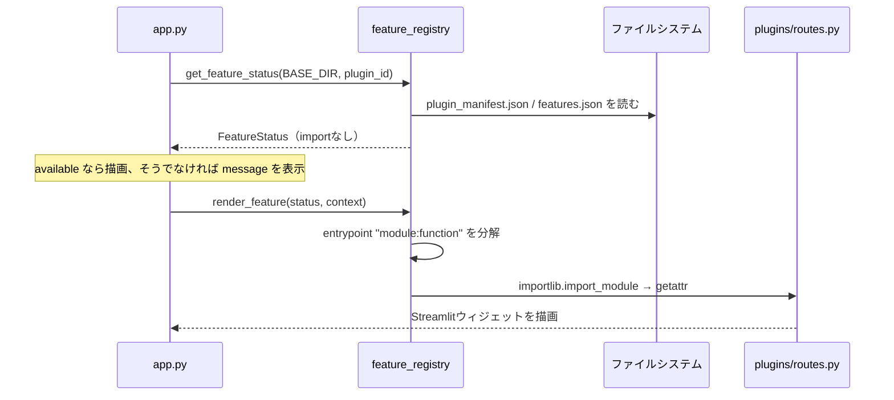

# 有料オプションプラグイン機構

`plugins/`、`optional_requirements/`、`core/feature_registry.py` が構成していた仕組みの仕様です。No.378で唯一の実装だった「実験条件検討」をメインプログラムへ統合したため、**現在このディレクトリ群を参照するコードはありません**。

- 対象コード：`plugins/`、`optional_requirements/`、`core/feature_registry.py`
- 導入：No.76（実験条件検討の開発プレビューと同時）
- 撤去：No.378（実験条件検討を `core/experiment_condition_advisor/` へ統合）
- 現状：ディレクトリは残置。どこからもimportされていない

## 1. 目的

有料オプション機能を、**コアアプリのコードから一切参照せずに** 追加・削除できるようにするための仕組みです。次の3つを同時に満たすことを狙っていました。

1. 有料機能を含まない配布物を作れる（ディレクトリを削除するだけ）
2. 有料機能を含む配布物でも、ライセンス状態に応じて表示を変えられる
3. 有料機能だけが必要とする依存関係（ReportLab）を、コアの依存関係から分離する

## 2. 構成要素

| パス | 役割 |
| --- | --- |
| `core/feature_registry.py` | 機能の状態判定と実行時ロード。コア側の唯一の入口 |
| `plugins/__init__.py` | プラグイン名前空間。「コアからプラグインを直接importしない」旨のみ記載 |
| `plugins/<plugin_id>/plugin_manifest.json` | プラグインの自己申告メタデータ。コアはこれだけを読む |
| `plugins/<plugin_id>/routes.py` | 画面描画の実体。manifestの `entrypoint` から呼ばれる |
| `config/features.json` の `features.<plugin_id>` | 配布側が設定する有効・無効とモード |
| `optional_requirements/<plugin_id>.txt` | そのプラグインだけが必要とする依存関係 |

コアがプラグインについて知っているのは **プラグインID文字列とmanifestの場所だけ** で、プラグイン固有の型・関数・定数はコードに現れません。`app.py` に書かれていたのは次の1行でした。

```python
EXPERIMENT_ADVISOR_STATUS = get_feature_status(BASE_DIR, EXPERIMENT_ADVISOR_PLUGIN_ID)
```

## 3. 状態判定：`get_feature_status()`

`plugins/<id>/plugin_manifest.json` と `config/features.json` を読み、`FeatureStatus`（frozen dataclass）を返します。**この関数はプラグインコードをimportしません。** JSONの読み取り失敗は空dictとして扱い、例外を投げません。

判定順序は次のとおりです。

1. manifestが存在しなければ `not_installed`
2. `config/features.json` の `enabled` を読む（未設定ならmanifestの `enabled_by_default`）
3. `mode` を読む（未設定なら `disabled`）
4. 環境変数 `ONCHIP_<プラグインID大文字>_MODE` があれば `mode` を上書き（小文字化・前後空白除去）
5. `enabled` が偽、または `mode` が `disabled` なら `disabled`
6. `mode` が `development_preview` / `licensed` なら利用可能
7. それ以外（`unlicensed` など未知の値を含む）は `license_required`

実験条件検討の場合の環境変数名は `ONCHIP_EXPERIMENT_CONDITION_ADVISOR_MODE` でした。

### モードと画面表示の対応

| mode | state | available | badge | 画面の状態 |
| --- | --- | --- | --- | --- |
| （manifestなし） | `not_installed` | False | 未搭載 | カードは「工事中／有料プラグイン対応」、ボタン無効 |
| `disabled` | `disabled` | False | 未搭載 | 同上 |
| `development_preview` | `available` | True | 開発プレビュー | 入力機能を表示 |
| `licensed` | `available` | True | 有効 | 入力機能を表示 |
| 上記以外（`unlicensed` 等） | `license_required` | False | ライセンスが必要 | 機能説明とライセンス案内のみ |

`badge` は `FeatureStatus` のプロパティで、`mode` と `available` から導出されます。`message` には利用者向けの日本語説明が入り、利用不可時にそのまま画面へ表示していました。

## 4. 実行時ロード：`render_feature()`



`entrypoint` は `"plugins.experiment_condition_advisor.routes:render"` の形式で、モジュールパスと関数名を `:` で区切ります。`available` でない状態で呼ぶと `RuntimeError`、`entrypoint` に `:` がなければ同じく `RuntimeError` になります。`importlib.invalidate_caches()` を呼んでからimportするため、実行中に配置したプラグインも読み込めます。

呼び出し規約は `renderer(context=..., feature_status=...)` の2キーワード引数でした。コアが渡していた `context` の内容は次のとおりです。

| キー | 値 |
| --- | --- |
| `base_dir` | アプリのルート `Path` |
| `navigation_version` | `app.py` の `VERSION` |
| `product_catalog` | 読み込み済みの製品一覧dict |
| `find_droplet_product_candidates` | `core/product_catalog.py` の関数オブジェクト |

製品一覧との連携を **関数と素のdictで渡していた** 点が要点です。プラグインは製品一覧ページの描画処理に依存せず、`core/product_catalog.py` の公開関数だけを使いました。

`app.py` 側は `render_feature()` の呼び出しを `try/except Exception` で包み、失敗しても「プラグインを外しても既存機能は利用できます」という案内を出して落ちない構造にしていました。

## 5. `optional_requirements/` の役割

プラグインだけが必要とする依存関係を、コアの `requirements.txt` から分離するためのディレクトリです。実験条件検討では `optional_requirements/experiment_condition_advisor.txt` に `reportlab>=4,<5` の1行だけが入っていました。

この分離は3か所で支えられていました。

1. **`launch.bat`** — ファイルが存在するときだけ追加インストールする条件分岐

   ```bat
   if exist optional_requirements\experiment_condition_advisor.txt (
     python -m pip install -r optional_requirements\experiment_condition_advisor.txt
   )
   ```

2. **`reports/pdf_generator.py`** — ReportLabのimportを `try/except ImportError` で包み、失敗時は `REPORTLAB_AVAILABLE = False` として `is_available()` が偽を返す
3. **`routes.py`** — `is_available()` が偽ならPDFボタンを出さず、「optional_requirements をインストールしてください」と案内する

つまり **ReportLabが無くてもプラグイン自体は動き、PDF出力だけが落ちる** 二段構えでした。

## 6. 分離ルール（removal contract）

manifestの `removal_contract` に、次の英文で明記されていました。

> The core application must start and all six workflows must remain usable after this plugin directory is removed.

`plugins/experiment_condition_advisor/README_PLUGIN.md` には、これを守るための具体的な禁止事項が挙げられていました。

- コアの `manual_steps.json` にプラグイン固有の工程や入力項目を追加しない
- 当時の進行状況保存（`PROGRESS_SCHEMA_VERSION=1`）にプラグイン入力を混ぜない
- コアコードからプラグインパッケージを直接importしない
- プラグイン固有の依存関係を `optional_requirements/` に分ける
- 製品一覧との連携は `core/product_catalog.py` の公開関数を介する

プラグイン側のデータも分離されていました。承認済み文献メタデータは `plugins/experiment_condition_advisor/data/approved_sources.json` に置かれ、`data/` 配下のコアデータとは混在していません。生成した入力内容のJSONにも `plugin_id`、`plugin_version`、`plugin_data_schema_version` を持たせ、コアの保存形式とは独立した版管理をしていました。

## 7. manifestの項目

コアが実際に読むのは `display_name`、`entrypoint`、`enabled_by_default` の3つだけです。残りは配布物の性質を人間が判別するための宣言です。

| キー | 値 | コアが読むか |
| --- | --- | --- |
| `plugin_id` | `experiment_condition_advisor` | いいえ |
| `display_name` | `実験条件検討` | はい |
| `plugin_type` | `paid_optional` | いいえ |
| `version` | `0.1.0-prototype` | いいえ |
| `navigation_version` | 対応するアプリ表示版 | いいえ |
| `entrypoint` | `plugins.experiment_condition_advisor.routes:render` | はい |
| `enabled_by_default` | `false` | はい（configに `enabled` がない場合のみ） |
| `requires_license` | `true` | いいえ |
| `requires_ai_backend` | `false` | いいえ |
| `ai_mode` | `closed_local_rule_prototype` | いいえ |
| `requires_pdf_backend` / `pdf_dependency` | `true` / `reportlab` | いいえ |
| `network_access` | `none` | いいえ |
| `data_classification` | `confidential_experiment_data` | いいえ |
| `plugin_data_schema_version` | `1` | いいえ |
| `removal_contract` | 前掲の英文 | いいえ |

## 8. 唯一のプラグイン実装：実験条件検討

機構そのものとは別に、載っていた機能の内容も記録しておきます。**この機能は現在も `core/experiment_condition_advisor/` で同じ内容が動作しています。**

### 処理の流れ

1. `routes.py` の `_build_case_data()` が、実験目的、封入対象、培地・水相、物性、目標液滴、油相・界面活性剤、作製後工程などの入力を集めて `case_data` にまとめる
2. 入力内容はいつでもJSONとしてダウンロードできる（`file_type: onchip_experiment_condition_advisor_case`）
3. 「閉域見解を生成・更新」で `core/product_catalog.py` の `find_droplet_product_candidates()` を呼び、目標径と掲載仕様だけから製品候補を抽出する
4. `LocalRuleAdvisorBackend.generate_opinion()` が見解dictを組み立てる
5. `reports/pdf_generator.py` がレポートPDFを生成する（ReportLabがある場合のみ）

### 閉域見解エンジン（`LocalRuleAdvisorBackend`）

生成モデルではありません。`ai/base.py` の `ExperimentAdvisorBackend` を実装した、決定的なルールベースの試作です。

- **入力充足度** — 12項目の入力有無から0〜100のスコアと不足項目一覧を作る
- **物理計算** — `domain/calculations.py` の球体積とポアソン分布のみ。液滴体積、平均封入数λ、空液滴率、1個封入率、多重封入率を算出する
- **リスク判定** — 多重封入が単一封入を上回る、凝集あり、増粘剤・ゲル化物質を含む、粘度が未測定、非ニュートン性の可能性、目標径が封入対象の最大寸法以下、生物適合性が未確認、といった条件で「高」「中」のリスク項目を積む
- **成立見込み** — 充足度スコアが45未満なら「判定不能」、高リスク2件以上なら「低」、いずれかのリスクがあれば「中」、スコア85以上でリスクなしなら「条件検討を進められる」
- **予備実験案** — 固定の5項目を提示する

返す見解dictには `engine_name`、`engine_version`、`network_access: "none"`、`outlook`、`data_completeness_score`、`missing_information`、`calculations`、`risks`、`cautions`、`product_candidates`、`preliminary_trials`、`sources`、`disclaimer` が含まれます。

**圧力、流量、界面活性剤濃度など、製品マニュアルまたは社内検証データにない具体値は生成しません。** 「成立見込み」も成功率の保証ではない旨を画面とPDFの両方に明記しています。

### 閉域ナレッジベース

`data/approved_sources.json`（`source_set_version: 2026-08-02-prototype-1`）に、一次研究5件のメタデータと承認済み要約を持ちます。フローフォーカシング、単一細胞封入、非ポアソン型整列、界面活性剤、FADSに関する論文で、いずれも「On-chip製品の運転条件を定める資料ではない」と注記したうえで参照表示していました。本文は保持せず、書誌情報と要約のみです。

## 9. No.378での統合内容

| 項目 | 統合前 | 統合後 |
| --- | --- | --- |
| 配置 | `plugins/experiment_condition_advisor/` | `core/experiment_condition_advisor/` |
| 呼び出し | manifest経由の実行時ロード | `app.py` から直接import |
| 呼び出し規約 | `render(context=dict, feature_status=...)` | `render(navigation_version=..., product_catalog=..., product_matcher=...)` |
| 状態判定 | `core/feature_registry.py` | なし（常時利用可能） |
| 設定 | `config/features.json` の `experiment_condition_advisor` | 削除 |
| ReportLab | `optional_requirements/` | `requirements.txt` |
| ホームカード | ライセンス状態で3分岐 | 「利用可能」固定 |
| サイドバー | 状態により無効化 | 常に有効 |
| 用語 | `PLUGIN_ID` / `PLUGIN_VERSION` | `FEATURE_ID` / `FEATURE_VERSION` |

入力項目、物理計算、ルール、承認済み文献、PDF出力の内容は変更されていません。

## 10. 現在の残置状態

No.378の統合後も、次のファイルはリポジトリに残っています。いずれも **どこからもimportされていません**。

- `plugins/`（`core/experiment_condition_advisor/` とほぼ同一内容の重複コピー。差分はモジュールdocstringと `PLUGIN_*` → `FEATURE_*` の名称のみ）
- `optional_requirements/experiment_condition_advisor.txt`
- `core/feature_registry.py`

参照が無いことは次で確認できます。

```bash
grep -rn "feature_registry\|from plugins\|import plugins\|optional_requirements" --include=*.py --include=*.bat --include=*.txt . | grep -v __pycache__ | grep -v "^./plugins/"
```

削除するか、将来の有料オプションに備えて機構だけ残すかは未決定です。再び有料オプションを設ける場合、`core/feature_registry.py` の状態判定と実行時ロードはプラグインIDを変えるだけで再利用できます。
